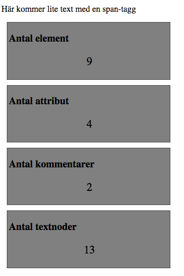

##Temple of DOM

I denna uppgift ska du gå igenom ett DOM-träd (från filen client/index.html) och sedan presentera antalet element, 
attribut, kommentarer och textnoder som dokumentet client/index.html består av. 

Resultatet presenteras för varje del i den template som finns med rubrik (inom h2-tag) och antal (inom p-taggen)

###Tips
* Att skriva en rekursiv funktion som går igenom nodträdet är en bra idé
* [https://developer.mozilla.org/en-US/docs/Web/API/Node/nodeType](https://developer.mozilla.org/en-US/docs/Web/API/Node/nodeType)
* Testa din sida i Ikognito-läge då vissa plugins och annat kan lägga till script- och styletaggar som då räknas med.
* Hur många element-taggar kommer template-taggen registreras som?
* [https://developer.mozilla.org/en-US/docs/Web/HTML/Element/template](https://developer.mozilla.org/en-US/docs/Web/HTML/Element/template)

Se bilden nedan hur det skulle kunna se ut. OBS! Bilden togs med plugins aktiverade så värdena kan skilja sig från vad du får fram.

